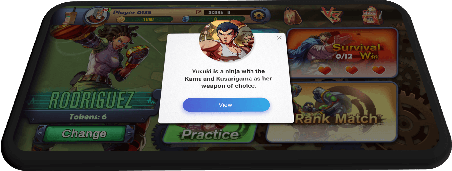

.. _topics-API:

================
SDK initialization
================

Description: Initialize the SDK parameters. Before using other API interfaces, you’ll need to call the initialization interface, which can be called when the community portal page is created.

.. code-block:: c

	WeGamersSDKParams params = new WeGamersSDKParams();
	params.setGameAccountId(String accountId);           
	//Parameter description: The player’s unique account ID, provided by the access party. Must be filled in.
	params.setNickName(String name);              
	//Parameter description: Player nickname. Provided by the access party.
	params.setSkinType(int iSkinType);                
	//Parameter description: Player nickname. Provided by the access party.         
	//SkinType.SKIN_WEGAMERS WeGamers theme         
	//SkinType.SKIN_VIOLET Purple theme            
	//SkinType.SKIN_DARK Dark theme               
	//SkinType.SKIN_LM Lords Mobile theme           
	//SkinType.SKIN_CC_COL2 Castle Clash theme          

	params.setLandscape(boolean isLandscape);
	//Parameter description: If horizontal screen: true , if vertical screen: false. Default is horizontal screen.
	//Note: This SDK allows you to switch between horizontal and vertical screen, and will remember the user's last operation. If setLandscape is consistent with the first value of the visit, // the screen orientation will be what was the user's last operation.
	params.setSdkId(String sdkId);
	//Parameter description: WeGamers backend SDK ID provided by WeGamers. Must be filled in.
	params.setSessionkey(String sessionKey);
	//Parameter description: sessionname officially provided by wegamers, provided by wegamers, required

	WegamersSDK.getInstance().setSdkParams(params);
	WegamersSDK.getInstance().initialize(Context ctx, new WegamersSDK.WGSDKInitListener() {
		@Override
		public void onInitComplete() { }	 
		
		@Override
		public void onShowEntrance(boolean isShow) {
			//Used selectively to control the community portal display (system version lower than 5.0 will have a generic prompt that cannot be 
			//used, the game side can hide the access entrance)
			//isShow: true normal display, false: can be hidden
		}
	});

	WegamersSDK.getInstance().setWGMsgReddotListener(
		new WegamersSDK.WGMsgReddotListener() {
			@Override
			public void onMsgReddot(boolean isHas) {
				//Event process latest message with a red dot prompt. Red dot prompt is displayed by the access side.
				//isHas true shows red dot, false removes red dot
		}
	});

================
Pop-up notification
================

Pop-up notification detection
=========================

Description: Detects the announcement notification message configured in backend. The UI of pop-up notification is displayed by the SDK. The interface can be called on the page that needs to be displayed. (As shown below.) Suggest to detect the notification after the game finished the starting. Please DO NOT use polling and avoid to detect it at the tutorial and during the gaming process.

.. code-block:: c

	WegamersSDK.getInstance().checkNewNoticeMessage();
	

Set the prohibition status of pop-up notification
=========================

Description: Notification message display page can be controlled by the access side to prevent data delays, which would result in the data being displayed in the middle of a battle. If the battle is started earlier, you can call this API control.

.. code-block:: c

	WegamersSDK.getInstance().setInComBat(boolean inComBat);
	//Parameter description: inComBat: true: enters battle, call checkNewNoticeMessage again will automatically set it to false.

================
Enter game community
================

Description: Enter the calling interface of the embedded community

.. code-block:: c

	WegamersSDK.getInstance().startBrowser(Context ctx);

================
Details of a post in the community
================

Description: Interface access is optional. To display post content, provide post details URL to enter embedded community

.. code-block:: c

	WegamersSDK.getInstance().startBrowser(Context ctx,String snsDetailUrl);
	//Parameter description: Context ctx: Activity context, String snsDetailUrl post details

================
Service control
================

service paused
=========================

Description: Leave the current page or enter the background, trigger the method on the page onPause, suspend the service (to avoid unnecessary ANR generated by the device above 8.0 for background service restrictions)

.. code-block:: c

    @Override
    protected void onPause() {
        super.onPause();
        WegamersSDK.getInstance().onPause();
    }

Recovery service
=========================

Description: This interface is called when returning to the current page for recovery service.

.. code-block:: c

	
    @Override
    protected void onResume() {
        super.onResume();
        WegamersSDK.getInstance().onResume();
    }

Destruction service
=========================

Description: This interface is called when the game is exited or the current page is destroyed, and is used to destroy the service process.

.. code-block:: c

	
    @Override
    protected void onDestroy() {
        WegamersSDK.getInstance().onDestroy();
        super.onDestroy();
    }

================
Initialization error code
================

Interface initialization prompt code is defined in ErrorCode

.. code-block:: c

	ERR_PARAMS_DEFECT = 6004;//missing parameter
	ERR_IGGID_DEFECT = 6000;//game ID missing
	ERR_SDKID_DEFECT = 6001;//SDKID missing
	ERR_NICKNAME_DEFECT = 6002;//game nickname missing
	ERR_SYS_VER = 6003;//system version is lower than 5.0
	ERR_SESSIONKEY_DEFECT = 6002;//key missing