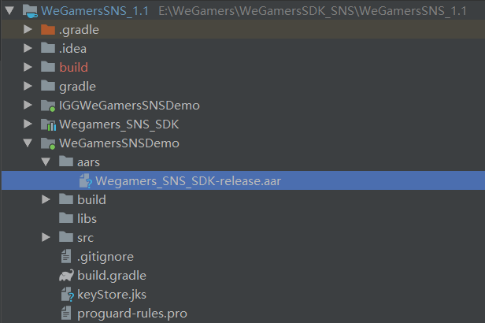

.. _topics-gradle Configuration:

================
Gradle Configuration
================

Copy aar file
=========================

- Directory file aars is generated under the project directory. Copy the aar file Wegamers_SNS_SDK-release.aar, configure reference file under build.gradle file, then import the required aar public library

Import a public library
=========================

- The configuration file reference under the build.gradle file, import the public library needed by aar, access the project already exists in the public library without importing

.. code-block:: c

	repositories {
		flatDir {
			dirs 'aars'
		
		}}

	dependencies {
		compile fileTree(include: ['*.jar'], dir: 'libs')
		
		compile 'com.android.support:appcompat-v7:23.4.0'
		
		//Retrofit
		
		compile ('com.squareup.retrofit2:converter-gson:2.2.0'){
			
			exclude group: 'com.squareup.okhttp3'
			
			exclude group: 'com.google.code.gson'
		
		}
		
		compile 'com.google.code.gson:gson:2.7'
		
		compile 'com.squareup.retrofit2:adapter-rxjava:2.2.0'
		
		compile 'com.squareup.okhttp3:logging-interceptor:3.6.0'
		
		//Rxjava
		
		compile 'io.reactivex:rxandroid:1.2.0'
		
		//Dagger
		
		compile 'com.google.dagger:dagger:2.2'
		
		compile 'org.greenrobot:eventbus:3.0.0'
		
		compile(name: 'Wegamers_SNS_SDK-release', ext: 'aar')
	}
