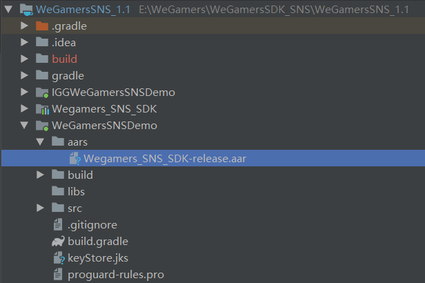

.. _topics-gradle Configuration:

================
Gradle Configuration
================

Community library reference configuration
=========================
- Mode 1 (recommended): import using wegamers GitHub warehouse, and configure it in the build.gradle file as follows

.. code-block:: c
	
	repositories {
		maven {
			url 'https://raw.githubusercontent.com/AppsInnova/WGCommunity/master/'
		}
	}
	
	dependencies {
		compile 'com.appsinnova.wegamers:community:1.0'
	}
	
- Mode 2：Directory file aars is generated under the project directory. Copy the aar file Wegamers_SNS_SDK-release.aar, configure reference file under build.gradle file, then import the required aar public library

Configure in the build.gradle file

.. code-block:: c

	repositories {
		flatDir {
			dirs 'aars'
		}
	}

Import a public library
=========================

- The build.gradle file is imported into other official public libraries. If there are public libraries in the access project, it is not necessary to import them.

.. code-block:: c

	dependencies {
	
		compile fileTree(include: ['*.jar'], dir: 'libs')
		compile 'com.android.support:appcompat-v7:23.4.0'
		//Retrofit
		compile ('com.squareup.retrofit2:converter-gson:2.2.0'){
			exclude group: 'com.squareup.okhttp3'
			exclude group: 'com.google.code.gson'
		}
		compile 'com.google.code.gson:gson:2.7'
		compile 'com.squareup.retrofit2:adapter-rxjava:2.2.0'
		compile 'com.squareup.okhttp3:logging-interceptor:3.6.0'
		//Rxjava
		compile 'io.reactivex:rxandroid:1.2.0'
		//Dagger
		compile 'com.google.dagger:dagger:2.2'
		compile 'org.greenrobot:eventbus:3.0.0'

	}
