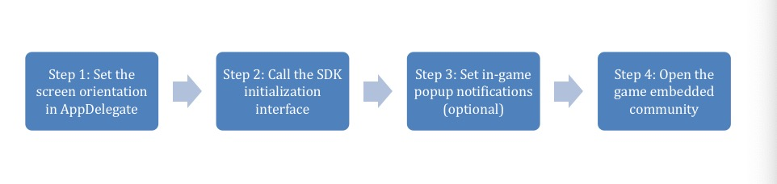
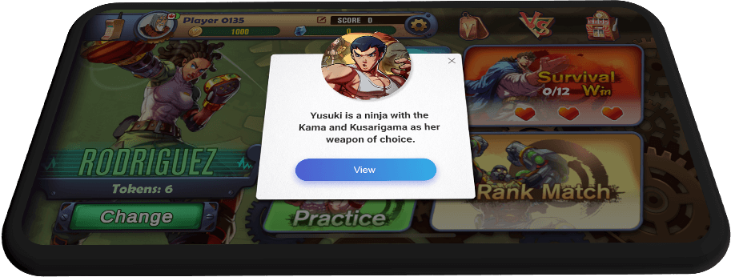

====================
SDK Getting Started
====================

Usage Instructions
====================

- Step 1: Initialize the screen orientation supported by the game in the AppDelegate system and set the supported embedded community screen orientation. See Demo Project
- Step 2: SDK initialization interface

.. code-block:: c

    + (void)initGameCommunity:(WeGamersSDKParams*)param showCommunityRed:(void (^)(BOOL bShow))showNotifyRedBlock supportGameCommunity:(void (^)(BOOL bSupport))supportBlock;

- Step 3: Set in-game pop-up community notification (can be called in the game interface that requires this function.)

.. code-block:: c

    + (void)checkGameCommunityNotice:(UIWindow *)window completionBlock:(void (^)(NSError * _Nullable error))completionHandler;

Function: Pop-up notifications are displayed in the game interface, providing an efficient way for community operation staff to disseminate  important content in the community. (As shown below.)

- Step 4: Open the game embedded community interface

.. code-block:: c

    + (GameCommunityEntryResult *)openGameCommunityHomePageAndwillExitLive:(void (^)(void))blockWillExit

Call this interface in-game via game community event

Demo Project
=============

Demo: Please refer to the attached GameCommunityDemo project.