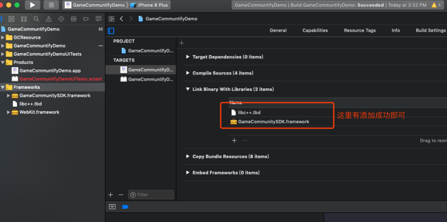

==================
Pod library mode
==================

Note: If the developer project supports Pod access to the third-party library, simply add a configuration code to the Podfile to re-pod Install (the configuration code is as follows),If you use the Pod library to access, you do not need to do resource import and project configuration operations.

.. code-block:: c

	pod 'WGCommunity', :git => "https://github.com/dev8ios/WGCommunity.git"

====================
SDK Resource import
====================

Copy the SDK and bundle resource files to project directory 
=============================================================

.. image::  ../images/image1.jpg

Add the bundle resource
=========================

.. image::  ../images/image2.jpg

.. image::  ../images/image3.jpg

Note: The five bundle resources can be selected according to their own engineering requirements. You can also select five bundle resources（and configure the corresponding GameCommunityThemType skinType in WeGamersSDKParams）

.. image::  ../images/image4.jpg

Add framework
================

.. image::  ../images/image5.jpg

.. image::  ../images/image6.jpg

