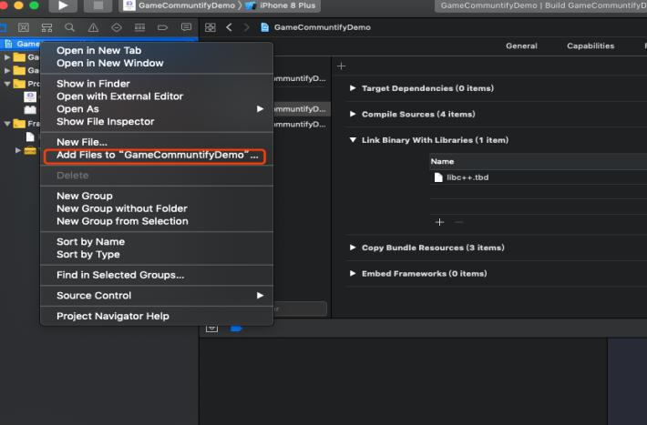
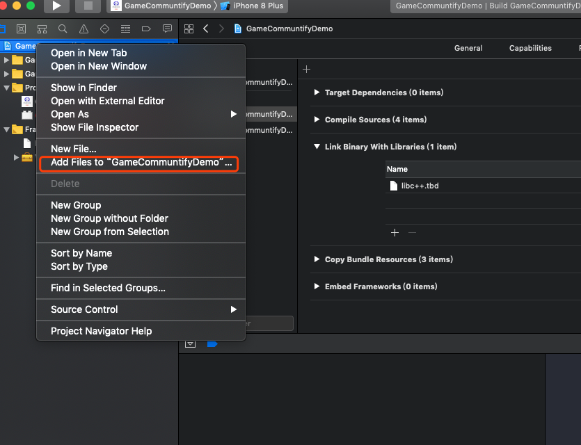
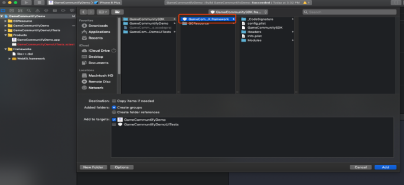

====================
SDK Resource import
====================

Copy the SDK and bundle resource files to project directory 
=============================================================

.. image::  ../images/image1.jpg

Add the bundle resource
=========================

.. image::  ../images/image3.jpg

Note: The five bundle resources can be selected according to their own engineering requirements. You can also select five bundle resources（and configure the corresponding GameCommunityThemType skinType in WeGamersSDKParams）

.. image::  ../images/image4.jpg

Add framework
================

.. image::  ../images/image7.jpg